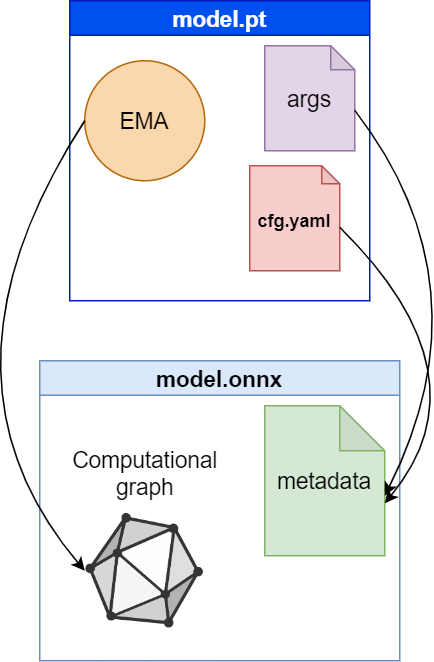
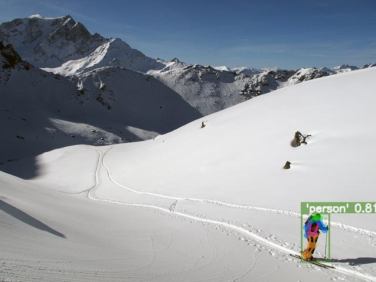
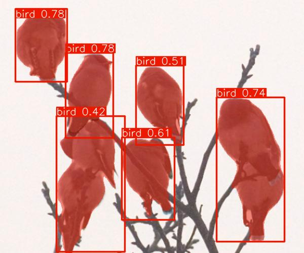
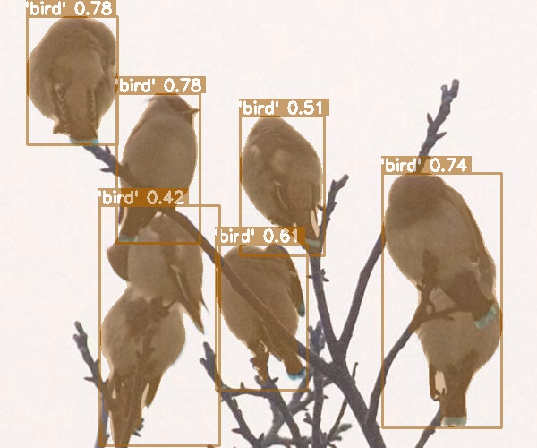
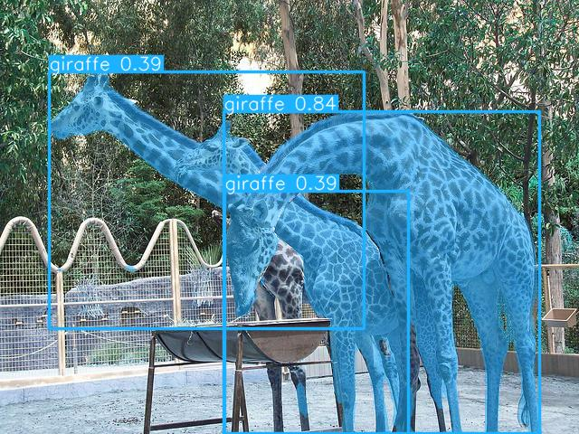
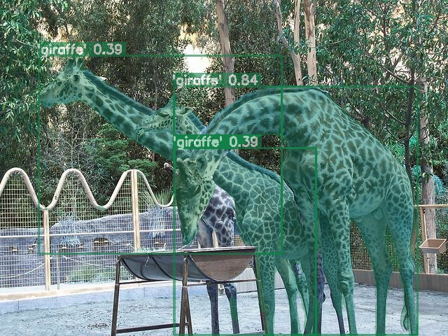
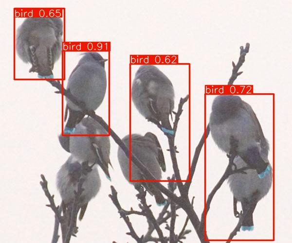
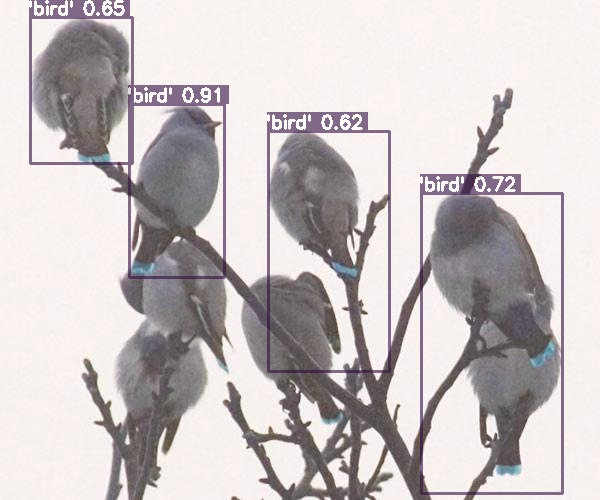
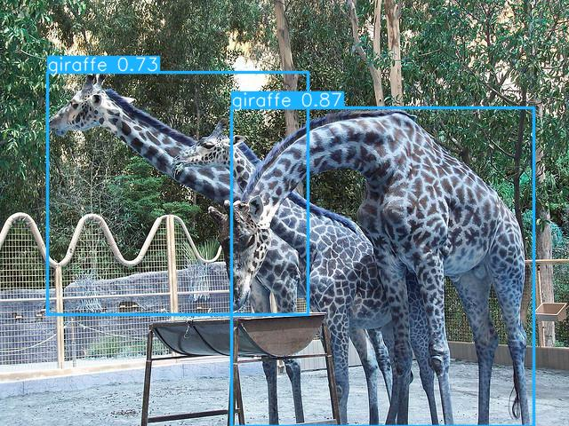
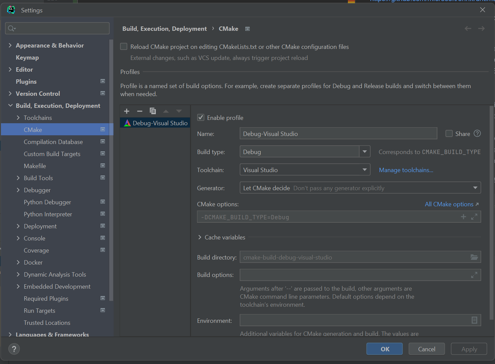

# yolov8-onnx-cpp

## Changelog
See the changelog [here](CHANGELOG.md)

## Description
Hello there! yolov8-onnx-cpp is a C++ demo implementation of the YOLOv8 model using the ONNX library.
This project is based on the YOLOv8 model by Ultralytics.
I aimed to replicate the behavior of the Python version and achieve consistent results across various image sizes.

By the way, you don't need to specify names, img_size etc while initializing the model, since we can use ONNX metadata!

When you do export in python in onnx format, the following code executes
```python
    self.metadata = {
        'description': description,
        'author': 'Ultralytics',
        'license': 'AGPL-3.0 https://ultralytics.com/license',
        'date': datetime.now().isoformat(),
        'version': __version__,
        'stride': int(max(model.stride)),
        'task': model.task,
        'batch': self.args.batch,
        'imgsz': self.imgsz,
        'names': model.names}  # model metadata
    if model.task == 'pose':
        self.metadata['kpt_shape'] = model.model[-1].kpt_shape
```

(ultralytics 8.0.160, ultralytics/engine/exporter.py lines 221-233))

We can use this parameters at least to define stride, task, names and image size as described in the schema below:



## Supported Tasks and Hardware

| Task       | Supported |
|------------|-----------|
| Detect     | ✔️        |
| Segment    | ✔️        |
| Pose       | ✔️        |
| Classify   |           |


| Hardware   | Supported |
|------------|-----------|
| CPU        | ✔️        |
| GPU        |           |


## Comparison between Python and C++

I exported `yolov8n.pt`, `yolov8n-seg.pt`, `yolov8n-pose.pt` to ONNX format with an input size of [480, 640] ([height, width]).
For the test I used some images from the COCO128 dataset with different image sizes than the specified input. 
This difference in sizes triggered letterboxing. I maintained consistent parameters, 
setting `conf=0.3` and `iou=0.5` for all models.

Here are the comparison results:


### Pose
Python Result


C++ Result



### Segmentation
Python Result 1



C++ Result 1



Python Result 2



C++ Result 2



### Object detection

Python Result 1



C++ Result 1



Python Result 2



C++ Result 2


## Getting Started
To get started with yolov8-onnx-cpp, follow these steps:

1. Clone the repository:
    ```shell
    git clone https://github.com/FourierMourier/yolov8-onnx-cpp.git
    ```
2. Setup additional libraries:

Download [opencv here](https://opencv.org/releases/) (4.80+)

### Solution-like build
* onnxruntime (1.50+) (nuget package)

### Cmake in non-visual studio-like ide
Copy `CMakeLists.example.txt` as `CMakeLists.txt` (git-ignored) and edit the following lines:
```cmake

SET (OpenCV_DIR your/path/to/opencv/build/x64/vc16/lib)  # opencv lib root
SET (OpenCV_BIN_DIR your/path/to/opencv/build/x64/vc16/bin)  #opencv bin root

SET (OpenCV_DEBUG_DLL_FILENAME opencv_world480d.dll)  # change filenames
SET (OpenCV_RELEASE_DLL_FILENAME opencv_world480.dll)  # change filenames

SET (ONNXRUNTIME_DIR your/path/to/onnxruntime-win-x64-1.15.1)  # onnxruntime root

```

Even though you'll find only a nuget package on the [official page](https://onnxruntime.ai/docs/install/#cccwinml-installs)
you can still download release for cmake file here for your platform:
https://github.com/microsoft/onnxruntime/releases

If you're working in different IDE like Clion rather than visual studio you still have to do the following:

* Install Visual Studio: If you haven't already, consider installing Visual Studio on your Windows system.
   You can download the Visual Studio Community edition for free from the official Microsoft website.
   Ensure that you select the components necessary for C++ development. 
* Configure CLion to Use Visual Studio: Open CLion, go to "File" > "Settings" > "Build, Execution, Deployment" > 
  "Toolchains." In the "Environment" section, select the Visual Studio toolchain that you installed.
  Make sure it points to the correct Visual Studio installation directory.

* CMake Configuration: Ensure that your CMake configuration in CLion specifies the Visual Studio generator 
  (e.g., "Visual Studio 2022").
  This can be set in "File" > "Settings" > "Build, Execution, Deployment" > "CMake" ( > "CMake options.")
  

So the issues like 
* https://github.com/microsoft/onnxruntime/issues/1175
* https://github.com/microsoft/onnxruntime/issues/9332
* https://github.com/microsoft/onnxruntime/issues/11545
will be gone

The issue like `"The given version [15] is not supported, only version 1 to 10 is supported in this build="`
https://github.com/microsoft/onnxruntime/issues/11230

also should not occur since you configure dll in cmake 

Hope that helps!

3. edit in the ./src/main.cpp img_path/&modelPath:
    ```cpp
    std::string img_path = "./images/000000000143.jpg";
    //const std::string& modelPath = "./checkpoints/yolov8n.onnx"; // detection
    const std::string& modelPath = "./checkpoints/yolov8n-seg.onnx"; // instance segmentation
    const std::string& onnx_provider = OnnxProviders::CPU; // "cpu";
    ```
# Usage
Provide an input image to the application, and it will perform object detection using the YOLOv8 model.
Customize the model configuration and parameters in the code as needed.

# References
* [YOLOv8 by Ultralytics](https://github.com/ultralytics/ultralytics)
* [ONNX](https://onnx.ai)
* [OpenCV](https://opencv.org)

# License
This project is licensed under the Apache 2.0 License - see the [LICENSE](LICENSE) file for details.

# Acknowledgments
Some other cool repositories I found useful (and you might too):
* https://github.com/winxos/yolov8_segment_onnx_in_cpp - another project implementing yolov8 segmentation in cpp
* https://github.com/cyrusbehr/YOLOv8-TensorRT-CPP - tensorrt impelemntation in cpp
* https://github.com/itsnine/yolov5-onnxruntime/tree/master yolov5 onnx in C++

This README was created with the assistance of OpenAI's ChatGPT (August 3 Version), a large language model.
You can learn more about it [here](https://chat.openai.com/chat)
